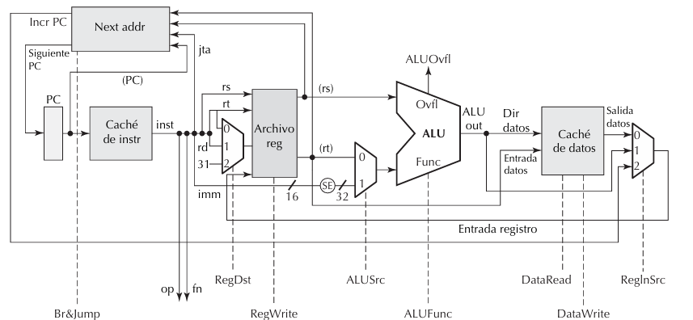

# Procesador RISC-V Monociclo - Práctica de Arquitectura de Computadoras

## Descripción del Proyecto

Este proyecto implementa un **procesador RISC-V monociclo básico** desarrollado en VHDL, diseñado para ejecutar instrucciones de suma (ADD e ADDI) en un solo ciclo de reloj. La implementación incluye la ruta de datos completa desde el Contador de Programa (PC) hasta la escritura de datos en registros.

## Objetivos de la Práctica

### Objetivo Principal
Diseñar una **unidad de control** para un procesador RISC-V monociclo que:
- Recibe el opcode (bits [6:0] de la instrucción)
- Genera las señales de control necesarias para ejecutar instrucciones correctamente en un solo ciclo

### Señales de Control Implementadas
- **RegWrite**: Habilita la escritura en el registro destino (rd)
- **ALUSrc**: Selecciona entre inmediato o rs2 como segundo operando de la ALU
- **MemRead**: Habilita la lectura desde memoria de datos
- **MemWrite**: Habilita la escritura en memoria de datos
- **MemToReg**: Selecciona si el valor a escribir en rd viene de la ALU o memoria
- **Branch**: Indica si es una instrucción de salto condicional
- **Jump**: Indica si es un salto incondicional (jal o jalr)
- **ALUOP**: Código que define qué operación debe realizar la ALU

## Arquitectura del Procesador

### Componentes Principales

1. **Program Counter (PC)**: Mantiene la dirección de la siguiente instrucción
2. **Instruction Memory**: Almacena las instrucciones del programa
3. **Control Unit**: Decodifica el opcode y genera señales de control
4. **Register File**: Banco de 32 registros de 32 bits (x0 siempre es 0)
5. **ALU Control**: Decodifica las operaciones específicas de la ALU
6. **ALU**: Unidad Aritmético-Lógica (implementa suma)
7. **Immediate Generator**: Extrae y extiende inmediatos con signo
8. **Data Memory**: Memoria de datos (para futuras expansiones)

### Ruta de Datos Implementada

```
PC → Instruction Memory → Control Unit → Register File → ALU → Write Back
     ↓                    ↓              ↓               ↓
     Instruction          Control        Operands        Result
                         Signals
```


### Simulación


## Decodificación de Instrucciones

### Proceso de Decodificación
La decodificación de instrucciones sigue un proceso de dos niveles que convierte el código máquina en señales de control específicas:

**Nivel 1 - Control Unit (Decodificación Principal):**
- Entrada: Opcode (bits [6:0] de la instrucción)
- Salida: Señales de control generales (RegWrite, ALUSrc, ALUOP, etc.)

**Nivel 2 - ALU Control (Decodificación Específica):**
- Entrada: ALUOP + funct3 + funct7
- Salida: Código específico para la operación ALU (ALUCtrl)

### Ejemplo Práctico: Decodificación de `addi x1, x0, 5`

```
Instrucción en binario: 00000000010100000000000010010011
Instrucción en hex:     0x00500093
```

**Paso 1 - Extracción de campos:**
```
[31:20] = 000000000101 → Inmediato = 5
[19:15] = 00000        → rs1 = x0
[14:12] = 000          → funct3 = 000
[11:7]  = 00001        → rd = x1
[6:0]   = 0010011      → opcode = 0010011 (I-type)
```

**Paso 2 - Control Unit decodifica opcode `0010011`:**
```vhdl
when "0010011" => -- I-type (ADDI)
    RegWrite <= '1';  -- Escribir resultado en x1
    ALUSrc   <= '1';  -- Usar inmediato (5) como segundo operando
    MemRead  <= '0';  -- No leer memoria
    MemWrite <= '0';  -- No escribir memoria
    MemToReg <= '0';  -- Escribir resultado de ALU en registro
    Branch   <= '0';  -- No es salto
    Jump     <= '0';  -- No es salto
    ALUOP    <= "00"; -- Operación de suma simple
```

**Paso 3 - ALU Control decodifica ALUOP `00`:**
```vhdl
when "00" => -- Instrucciones I-type
    ALUCtrl <= "0010"; -- Código específico para suma
```

**Resultado:** La instrucción `addi x1, x0, 5` se ejecuta sumando el contenido de x0 (que siempre es 0) con el inmediato 5, almacenando el resultado (5) en el registro x1.

## Instrucciones Soportadas

### Instrucciones Tipo R (Registro-Registro)
- **ADD**: `add rd, rs1, rs2` - Suma dos registros
  - Opcode: `0110011`
  - Ejemplo: `add x3, x1, x2` (x3 = x1 + x2)

### Instrucciones Tipo I (Inmediato)
- **ADDI**: `addi rd, rs1, imm` - Suma registro con inmediato
  - Opcode: `0010011`
  - Ejemplo: `addi x1, x0, 5` (x1 = x0 + 5)

## Programa de Prueba

El procesador incluye un programa de prueba pre-cargado en la memoria de instrucciones:

```assembly
addi x1, x0, 5     # x1 = 0 + 5 = 5
addi x2, x0, 3     # x2 = 0 + 3 = 3
add  x3, x1, x2    # x3 = x1 + x2 = 8
addi x4, x3, 4     # x4 = x3 + 4 = 12
sw   x1, 0(x0)     # Almacenar x1 (valor 5) en memoria dirección 0
lw   x5, 0(x0)     # Cargar x5 desde memoria dirección 0 (x5 = 5)
```

### Resultados Esperados:
- **Registros**: x1 = 5, x2 = 3, x3 = 8, x4 = 12, x5 = 5
- **Memoria**: dirección 0 contiene el valor 5
- **Verificación Load/Store**: x5 debe contener el mismo valor que x1 (5)

## Archivos del Proyecto

### Componentes Principales
- `RISCV_Processor.vhd`: Módulo principal que conecta todos los componentes
- `ControlUnit.vhd`: Unidad de control que decodifica opcodes
- `ALU.vhd`: Unidad Aritmético-Lógica
- `ALUControl.vhd`: Control específico de la ALU
- `RegisterFile_32bit.vhd`: Banco de registros de 32 bits
- `InstructionMemory.vhd`: Memoria de instrucciones
- `DataMemory.vhd`: Memoria de datos
- `ImmGen.vhd`: Generador de inmediatos

### Simulación
- `RISCV_Enhanced_TB.vhd`: Testbench para verificación funcional

## Herramientas Utilizadas

- **Quartus II**: Para síntesis y análisis del diseño
- **ModelSim/Multisim**: Para simulación funcional usando el testbench

## Características Técnicas

- **Arquitectura**: RISC-V de 32 bits
- **Tipo**: Monociclo (una instrucción por ciclo de reloj)
- **Registros**: 32 registros de 32 bits (x0-x31)
- **Memoria de instrucciones**: 256 palabras de 32 bits
- **Memoria de datos**: 256 palabras de 32 bits
- **Operaciones**: Suma con signo

## Limitaciones Actuales

- Solo implementa operaciones de suma (ADD, ADDI)
- No incluye instrucciones de salto o carga/almacenamiento
- Memoria de datos no utilizada en esta versión
- No implementa pipeline

## Posibles Extensiones

1. **Más operaciones aritméticas**: SUB, SLT, etc.
2. **Operaciones lógicas**: AND, OR, XOR
3. **Instrucciones de carga/almacenamiento**: LW, SW
4. **Instrucciones de salto**: BEQ, BNE, JAL, JALR
5. **Implementación de pipeline**

## Verificación

La simulación demuestra:
- Correcta decodificación de instrucciones
- Funcionamiento de la unidad de control
- Ejecución apropiada de operaciones de suma
- Actualización correcta del Program Counter
- Escritura adecuada en el archivo de registros

## Conclusiones

Este proyecto proporciona una base sólida para entender el funcionamiento interno de un procesador RISC-V. Aunque limitado a operaciones de suma, demuestra todos los conceptos fundamentales de la arquitectura de computadoras:

- Ciclo de búsqueda, decodificación y ejecución
- Ruta de datos y señales de control
- Interacción entre componentes del procesador
- Diseño modular y escalable

La implementación modular facilita futuras expansiones para soportar el conjunto completo de instrucciones RISC-V.